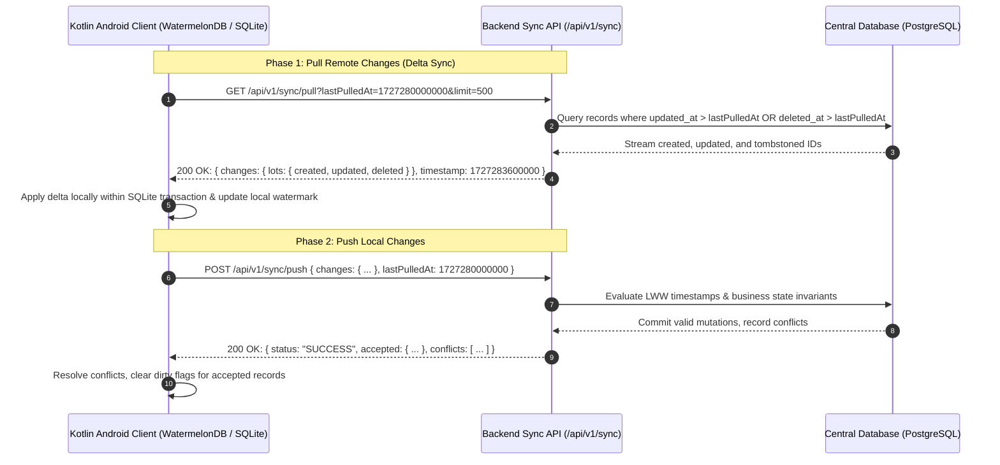

# Offline-First Synchronization Contract (WatermelonDB Protocol)

This document specifies the wire contract, synchronization semantics, tombstone lifecycle, and conflict resolution rules between the backend server and Android/Kotlin edge clients.

---

## 1. Protocol Architecture & Overview

The platform uses a bidirectional delta-sync architecture fully compatible with **WatermelonDB** and local SQLite databases on Android edge devices. 



---

## 2. Synchronized Table Catalog

| Table Name | Synchronization Mode | Primary Key | Description & Tenant Isolation |
|:---|:---|:---|:---|
| `farmers` | `read_write` | `farmer_id` (string UUID) | Farmer profile, display name, state LGD code, consent reference. Tenant-scoped to FPO `org_id`. |
| `land_parcels` | `read_write` | `farm_id` (string UUID) | Georeferenced farm plots, area in hectares, farmer association. |
| `lots` | `read_write` | `lot_code` (string) | Raw commodity lots, quantity MT, lifecycle status (`draft`, `registered`, `warehoused`, `traded`). |
| `assay_reports` | `read_write` | `id` (`ASSAY-{lot_code}`) | Quality assay scores, moisture %, foreign matter %, defect %, tamper-evident HMAC. |
| `buyer_demand` | `read_write` | `demand_id` (string UUID) | Institutional buyer procurement orders, target grade, target price. |
| `inventory_lots` | `read_write` | `lot_code` (string) | Aggregated warehouse inventory and lot state at the FPO storage hub. |
| `market_prices` | `read_only` | `id` (int ID) | AGMARKNET continuous rollups and VWAP mandi quotes. Server-authoritative. |
| `facilities` | `read_only` | `id` (string UUID) | Logistics facilities, cold storage availability, daily holding charges. Server-authoritative. |
| `trade_contracts` | `read_only` | `contract_code` (string) | Executed bilateral trade agreements, escrow state, settlement holds. Server-authoritative. |
| `consent_artifacts`| `read_only` | `artifact_id` (string UUID) | DPDP Act 2023 digitally signed consent records. Server-authoritative. |

> [!IMPORTANT]
> **Read-Only Enforcement**: Any client attempts to push mutations (`created`, `updated`, or `deleted`) to `read_only` tables are rejected immediately with conflict type `read_only_table` (`server_authoritative`).

---

## 3. Pull Contract (`GET /api/v1/sync/pull`)

### Request Query Parameters
| Parameter | Type | Required | Default | Description |
|:---|:---|:---|:---|:---|
| `lastPulledAt` | `integer` (int64) | Optional | `null` | High-water mark timestamp in epoch milliseconds. If omitted, performs initial full sync. |
| `schemaVersion`| `integer` | Optional | `1` | Client WatermelonDB schema version for migration compatibility. |
| `migrationVersion` | `integer` | Optional | `1` | Database migration version. |
| `limit` | `integer` | Optional | `500` | Max records per table batch (min: 1, max: 2000). |
| `cursor` | `string` | Optional | `null` | Base64-encoded pagination cursor (`<table_index>:<offset>`) for chunked transfers. |

### Response Schema (`SyncPullResponse`)
```json
{
  "changes": {
    "lots": {
      "created": [
        {
          "id": "LOT-IND-2026-0012",
          "farmer_id": "FARMER-MP-001",
          "commodity": "Wheat",
          "variety": "Sharbati",
          "quantity_mt": 12.5,
          "status": "registered",
          "consent_artifact_id": "CA-8891-2026",
          "enam_lot_id": null,
          "warehouse_receipt_id": null,
          "org_id": "FPO-MALWA-01",
          "created_at": 1727280100000,
          "updated_at": 1727280100000,
          "deleted_at": null
        }
      ],
      "updated": [],
      "deleted": [
        "LOT-IND-2026-0005"
      ]
    },
    "farmers": { "created": [], "updated": [], "deleted": [] },
    "land_parcels": { "created": [], "updated": [], "deleted": [] },
    "assay_reports": { "created": [], "updated": [], "deleted": [] },
    "buyer_demand": { "created": [], "updated": [], "deleted": [] },
    "inventory_lots": { "created": [], "updated": [], "deleted": [] },
    "market_prices": { "created": [], "updated": [], "deleted": [] },
    "facilities": { "created": [], "updated": [], "deleted": [] },
    "trade_contracts": { "created": [], "updated": [], "deleted": [] },
    "consent_artifacts": { "created": [], "updated": [], "deleted": [] }
  },
  "timestamp": 1727283600000,
  "next_cursor": null,
  "has_more": false
}
```

---

## 4. Push Contract (`POST /api/v1/sync/push`)

### Request Body (`SyncPushPayload`)
```json
{
  "changes": {
    "lots": {
      "created": [
        {
          "id": "LOT-IND-2026-0099",
          "farmer_id": "FARMER-MP-001",
          "commodity": "Soybean",
          "variety": "JS-335",
          "quantity_mt": 8.0,
          "status": "draft",
          "consent_artifact_id": "CA-8891-2026",
          "created_at": 1727283500000,
          "updated_at": 1727283500000
        }
      ],
      "updated": [
        {
          "id": "LOT-IND-2026-0012",
          "quantity_mt": 14.0,
          "updated_at": 1727283550000
        }
      ],
      "deleted": [
        "LOT-IND-2026-0008"
      ]
    }
  },
  "lastPulledAt": 1727280000000
}
```

### Response Schema (`SyncPushResponse`)
```json
{
  "status": "SUCCESS",
  "accepted": {
    "lots": { "created": 1, "updated": 1, "deleted": 0 }
  },
  "conflicts": [
    {
      "table": "lots",
      "id": "LOT-IND-2026-0008",
      "type": "delete_rejected",
      "resolution": "rejected_active_lien_or_listing",
      "server_version": { "status": "warehoused" },
      "client_version": null,
      "message": "Cannot delete lot with active pledge lien or listed status."
    }
  ],
  "server_time": 1727283605000
}
```

---

## 5. Tombstone Rules & Lifecycle

1. **Soft-Delete Architecture**:
   - Entities are never physically removed with `DELETE FROM table`.
   - Deletions write a timestamp to `deleted_at = NOW()` and retain all attributes.
2. **Delta Extraction for Pull**:
   - If `f.deleted_at > last_pulled_at`: Added to `deleted: [id1, id2]`.
   - If `last_pulled_at is null` (initial sync): Soft-deleted records are omitted from `created` and `updated`.
3. **Tombstone Pruning**:
   - Tombstones are retained in the central database for **90 days**.
   - Background maintenance jobs prune records where `deleted_at < NOW() - INTERVAL '90 days'`. Clients offline for $>90$ days receive HTTP `409 CONFLICT` requiring an initial full resync (`lastPulledAt = null`).
4. **Deletion Protection Invariants**:
   - Lots with active pledge finance liens (`LIEN_MARKED`) **cannot be deleted**.
   - Lots in `registered`, `warehoused`, or `traded` status **cannot be deleted**.
   - Executed `trade_contracts` **cannot be deleted**.

---

## 6. Deterministic Conflict Resolution (Last-Write-Wins)

When changes are pushed concurrently from multiple edge devices or between edge and backend:

### Case 1: Pushed `created` with Existing Server UUID
- **Condition**: Client creates a record with a client-generated UUID, but that UUID already exists on the server.
- **Resolution**: Server treats the operation as an update, applies field-level merges, increments `updated` counter, and returns conflict type `created_existing_uuid` with resolution `merged_as_update`.

### Case 2: Concurrent Update (`server_updated_at > client_updated_at`)
- **Condition**: The server record was modified by another operator or background job after the client's `lastPulledAt`.
- **Resolution**: **Last-Write-Wins (LWW)** based on UTC timestamp in milliseconds.
  - If `server_updated_at > client_updated_at`: **Server wins**. Client update is discarded, returning conflict `concurrent_update` (`server_won`). The client receives the authoritative server version in the next pull.
  - If `client_updated_at >= server_updated_at`: **Client wins**. Client attributes overwrite server attributes, and `updated_at` is set to `NOW()`.

### Case 3: Update to Non-Existent Record
- **Condition**: Client pushes `updated` for a record that does not exist in the central database.
- **Resolution**: Server automatically creates the record (`upsert` semantics), incrementing `created` count.

---

## 7. Cursor Semantics & Pagination

- For low-bandwidth rural networks, pull queries are chunked using deterministic cursors.
- Format: `base64(table_index:offset)`.
- If a pull batch exceeds `limit` (default: 500 records), the server returns:
  ```json
  {
    "has_more": true,
    "next_cursor": "MQ==:500"
  }
  ```
- The client loops using `GET /api/v1/sync/pull?cursor=MQ==:500&lastPulledAt=...` until `has_more == false`.
- The client **only updates its local `lastPulledAt` high-water mark** once all pages have been successfully retrieved and committed locally.
